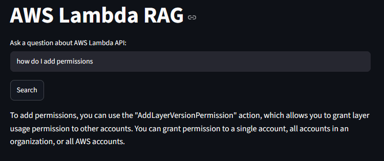

# AWS Lambda API RAG

This is a simple RAG (Retrieval-Augemented Generation) project that answers questions about the 
 documentation the [AWS lambda API reference guide](https://docs.aws.amazon.com/lambda/latest/api/Welcome.html)
 

# How it works

1. Load markdown files from the `/data` folder
2. Split the data into chunks of 300 characters.
3. Creating embbedings for each chunk that convert the text into vectors of numbers using HuggingFace's `all-MiniLM-L6-v2` model.
4. Save the text and the embeddings to a ChromaDB database, which will be used to search by similarity.
5. When a query is submitted, it is embedded with the same model as the data and finds the 3 most similar chunks.
    - To build the response we are using groq `llama-3.3-70b-versatile`.
6. The query response is built by passing the 3 chunks as context into Groq's model to generate the final answer.
7. The app uses streamlit as a minimal gui

# Setup
1. Create and activate a virtual environment (with Conda for example)
2. Install the dependencies using `pip install -r requirements.txt`
3. Create a `.env` file in the root directory that will contain the Groq api key as follows:

`GROQ_API_KEY=`

To run go to the main directory where main.py is located and run the following command:

`streamlit run main.py`

Here's an example of a query after the program is started:

